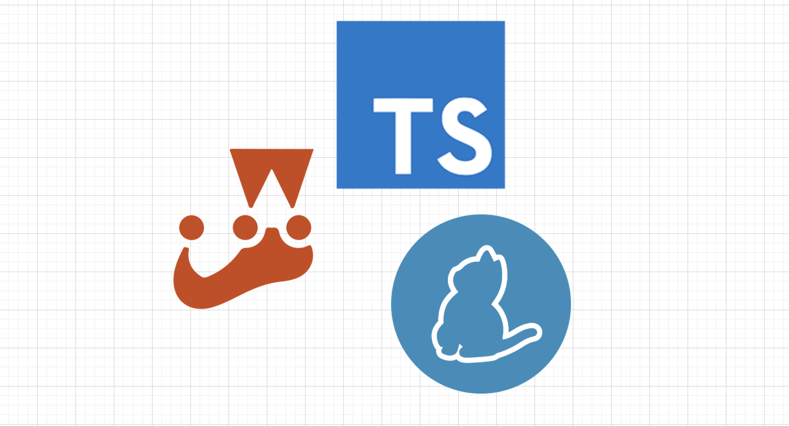
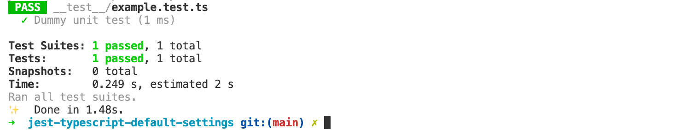
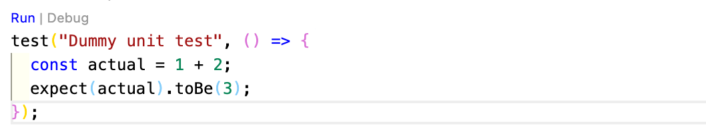

# JEST-TypeScript-Settings

<p align="center"><a href=""></a></p>

&nbsp;&nbsp;&nbsp;&nbsp;&nbsp;&nbsp;&nbsp;&nbsp;&nbsp;&nbsp;&nbsp;&nbsp;&nbsp;&nbsp;&nbsp;&nbsp;&nbsp;&nbsp;&nbsp;


프로젝트에 대한 간단한 설명이나, 이 프로젝트를 제작한 단체 혹은 회사에 대한 설명을 작성합니다(3~4줄 내외)
깃은 컴퓨터 파일의 변경사항을 추적하고 여러 명의 사용자들 간에 해당 파일들의 작업을 조율하기 위한 분산 버전 관리 시스템이다.
소프트웨어 개발에서 소스 코드 관리에 주로 사용되지만 어떠한 집합의 파일의 변경사항을 지속적으로 추적하기 위해 사용될 수 있다.

<br/>

---

## Table of Contents

- [프로젝트로 시작하기](#프로젝트로-시작하기)
  - [설치 하기](#설치-하기)
  - [테스트 하기](#테스트-하기)
- [직접 설정하기](#직접-설정하기)
  - [폴더 생성하기](#폴더-생성하기)
  - [yarn 설정 파일 생성하기](#yarn-설정-파일-생성하기)
  - [jest를 위한 라이브러리 설치하기](#jest를-위한-라이브러리-설치하기)
  - [바벨 설치하기](#바벨-설치하기)
  - [config 파일 생성하기](#config-파일-생성하기)
  - [테스트 폴더 생성하기](#테스트-폴더-생성하기)
  - [테스트 해보기](#테스트-해보기)
  - [vscode에 extension 설치하기](#vscode에-extension-설치하기)

<br/>

## 프로젝트로 시작하기

직접 라이브러리를 설정하지 않고, 프로젝트을 그대로 사용하는 방법입니다.

### 설치 하기

```
yarn install
```

### 테스트 하기

```
yarn test
```

<br/><br/>

## 직접 설정하기

직접 설정하는 경우에 아래 메뉴얼 대로 할 수 있습니다.

### 폴더 생성하기

```js
mkdir jest-test
cd jest-test
```

<br/>

### yarn 설정 파일 생성하기

- 아래 명령어를 사용하면, package.json 파일이 생성됩니다.
- 이 파일은 패키지 설정 파일이며, 라이브러리와 스크립트 정보를 정의합니다.

```js
yarn init
```

<br/>

### jest를 위한 라이브러리 설치하기

```js
yarn add -D typescript jest @types/jest ts-jest
```

<br/>

### 바벨 설치하기

- 바벨은 바벨이란 입력과 출력이 모두 자바스크립트 코드로 만들어주는 컴파일러입니다.
- 바벨을 설치하면 JSX 문법, 타입스크립트, 코드 압축, 제안 단계의 문법들을 사용할 수 있습니다.
- 타입스크립트를 사용하기 위해 바벨을 설치해주어야 합니다.

```js
yarn add --dev babel-jest @babel/core @babel/preset-env
```

<br/>

### config 파일 생성하기

- 테스트 도구인 jest에 관한 설정파일을 생성합니다. (`jest.config.js`)
- 테스트할 파일(`XXX.ts`)과 그 파일을 테스트 하는 파일(`XXX.test.ts`)은 서로 가깝게 위치해 있는 게 좋습니다.
- <a href="https://kulshekhar.github.io/ts-jest/docs/getting-started/presets/">`preset`</a>를 설정하여 jest 구성 사전 설정을 할 수 있습니다.

```js
//jest.config.js
module.exports = {
  preset: "ts-jest", //trypeScript파일은 ts-jest에서 CommonJS구문으로 변환
  testEnvironment: "node", //테스트 환경
  testMatch: ["**/*.spec.[jt]s?(x)", "**/*.test.[jt]s?(x)"], //테스트 파일 위치
};
```

<br/>

### 테스트 폴더 생성하기

- 프로젝트 루트 위치에 `__test__` 폴더를 생성합니다.

```js
mkdir __test__
```

- `__test__`에 `sample.test.ts`을 생성합니다.

```js
//__test__ / sample.test.ts
test("Dummy unit test", () => {
  const actual = 1 + 2;
  expect(actual).toBe(3);
});
```

<br/>

### 테스트 해보기

- 터미널에 아래 명령어를 입력하여 테스트가 잘 되는지 확인해보자!

```js
yarn test
```



<br/>

### vscode에 extension 설치하기

- 만약 vscode를 사용하는 경우, `jest`, `jest Runner`를 설치해보세요.
- `yarn test`를 하지 않고 코드 위에 등장하는 `run` 버튼으로 바로 테스트할 수 있습니다.

```js
yarn test
```



<br/>
<br/>
